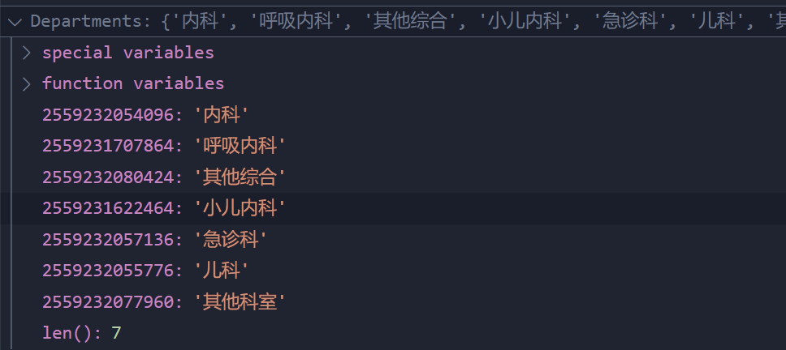
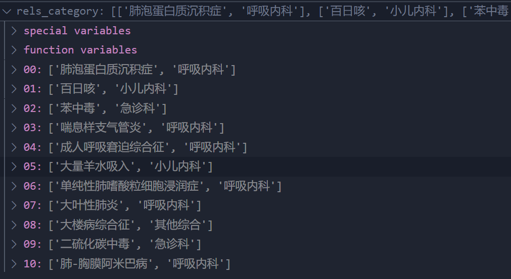

# QAMedicalKG

### build_medicalgrapy.py

1. main函数
   1. 使用MedicalGraph类的自构造函数导入json数据路径、连接数据库
   2. create_graphnodes() 创建知识图谱实体节点类型
      1. read_nodes()创建结点和关系列表之后读取文件
      2. create_diseases_nodes()创建以疾病为中心多个属性与之关联的辐射状知识图谱
      3. create_node()建立节点
   3. create_graphrels() 创建实体关系边
      1. read_nodes()再次读取相关信息
      
         ```python
         
         Drugs, Foods, Checks, Departments, Producers, Symptoms, Diseases, disease_infos, 
         
         # 以上疾病的相关属性这里用不到，而且只是一些独立的结点并没有和疾病之间建立联系
         # 可以注意到上面的属性部分和下面的疾病关联实体是有交集的，但是大部分还是从疾病相关的不同方向去分析的。
         
         rels_check, 
         rels_recommandeat, 
         rels_noteat, 
         rels_doeat, 
         rels_department,   # 部门科室之间的关系
         rels_commonddrug,
         rels_drug_producer,  # 疾病和生产厂商之间的关系
         rels_recommanddrug,
         rels_symptom, 
         rels_acompany, 
         rels_category = *self*.read_nodes()  # 疾病和科室之间的关系
         ```
      
         
      
         
      
         
      
         
      
         
      
      2. create_relationship() 创建实体关联边


### chatbot_graph.py

导入：

```python

from question_classifier import *
from question_parser import *
from answer_search import *
```

1. 主函数
   1. 使用ChatBotGraph类的自构造函数导入三个类的构造函数并重新命名
   2. 在chat_main()中将输入问题作为参数调用classifier.classify()将多个分类结果进行合并处理，组装成一个字典返回，如果返回为空返回answer；否则，继续将返回结果送入parser.parser_main()进行语法分析，并再次将返回结果送入searcher.search_main()执行cypher查询，并返回相应结果作为final_answer。如果最终答案为空，返回answer，否则返回换行+final_answer。


### question_classifier.py

1. 主函数
   1. 使用QuestionClassifier类的自构造函数导入数据
      1. 调用build_actree() 构造AC树加速多模匹配，给每一个词建立索引
      2. 调用build_wdtype_dic() 构建词典，对照词对应的类型给词打上类型标签
   2. 输入用户问题通过calssify()对问题解构

### question_parser.py

1. 主函数
   1. QuestionParser() 空的 没有手动生成构造函数 到那时不影响调用使用。
   2. 解析主函数 parser_main()
      1. build_entitydict() 构建实体字典
      2. 对不同的问题进行分开处理 sql_transfer()返回sql


### answer_search.py

1. 主函数
   1. AnswerSearcher()连接图数据库，答案数量限置为20
2. search_main() 执行cypher查询，并返回相应结果
3. answer_prettify() 根据对应的qustion_type，调用相应的回复模板


